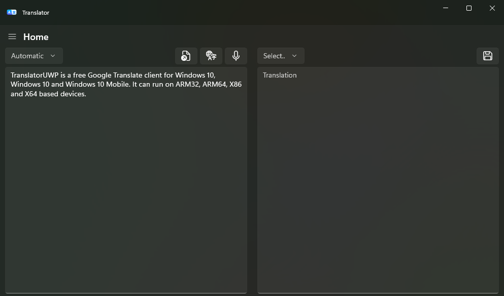

  
  <h1>Translator UWP</h1>
  <h2>A UWP client for Google Translate</a>

### Screenshot

### Supported windows versions:
Windows 10 (Build 16229 or higher)

Windows 10 Mobile (Build 15063 or higher)

Windows 10X (Spanning supported)

Windows 11

ARM32, ARM64, X86, X64
